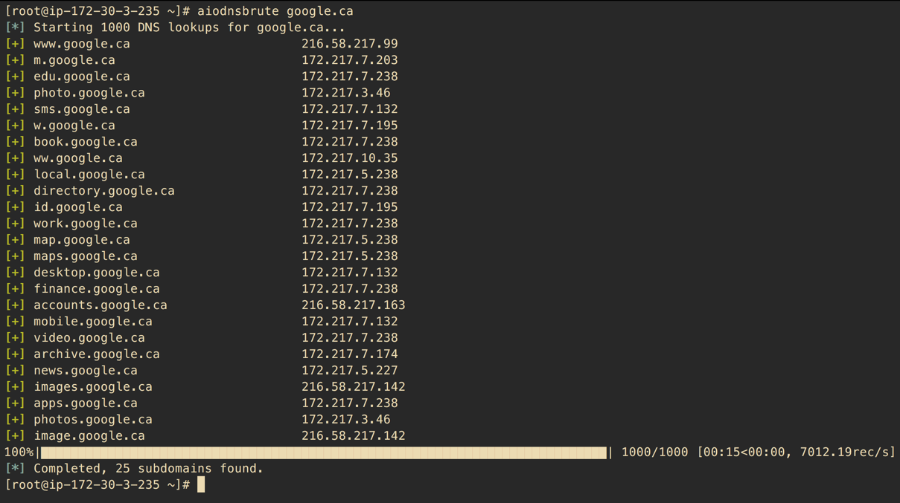

# Async DNS Brute

A Python 3.5+ script that uses asyncio to brute force domain names asynchronously.

## Speed

*It's fast.* Benchmarks on small VPS hosts put around 100k DNS resoultions at 1.5-2mins. An amazon M3 box was used to make 1 mil requests in just over 3 minutes. Nothing has been optimized and I haven't even started looking into threading/multiprocessing...

### Warning

This code is highly experimental, use at your own risk. There is lots of stuff that still hasn't been completed. But despite the very rough edges it works.

The biggest issues at the moment is that there is absolutely no memory management, if you throw wordlist with 100m words at it on a box with 1gb of memory it will crash. Also, there is currently no handler for DNS timeouts, we just ignore them and keep moving... that will be fixed later.

# Installation

If you don't use `pipsi`, you're missing out.
Here are [installation instructions](https://github.com/mitsuhiko/pipsi#readme).

## Debian/Kali/Ubuntu

The following should get you up and running.

    $ sudo apt-get install python3-pip
    $ sudo pip3 install virtualenv
    $ curl https://raw.githubusercontent.com/mitsuhiko/pipsi/master/get-pipsi.py | python3

...add pipsi path to your .bashrc, source bashrc file

    $ git clone https://github.com/blark/aiodnsbrute.git
    $ cd aiodnsbrute
    $ pipsi install .

## Usage

Get help with:

    $ aiodnsbrute --help

Run a brute force with some custom options:

    $ aiodnsbrute -w wordlist.txt -vv -t 1024 domain.com

*note* you might want to do a `ulimit -n` to see how many open files are allowed. You can also increase that number using the same command, i.e. `ulimit -n <2048>`
